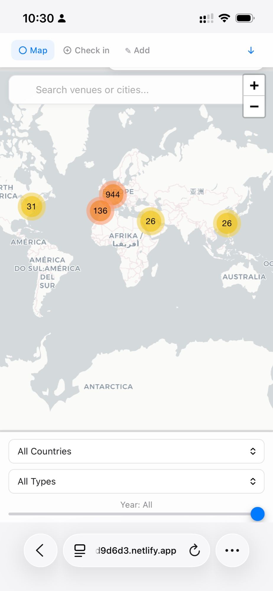
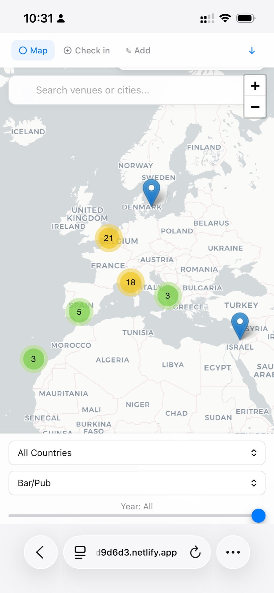
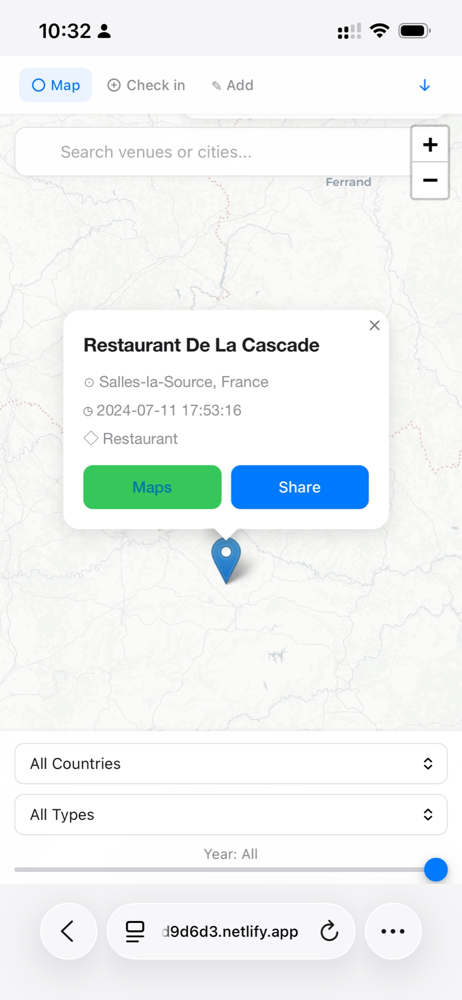
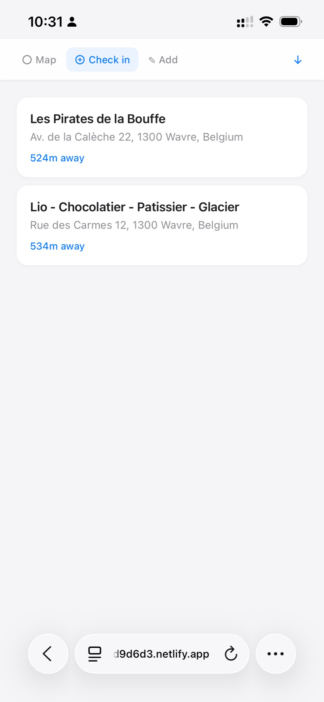
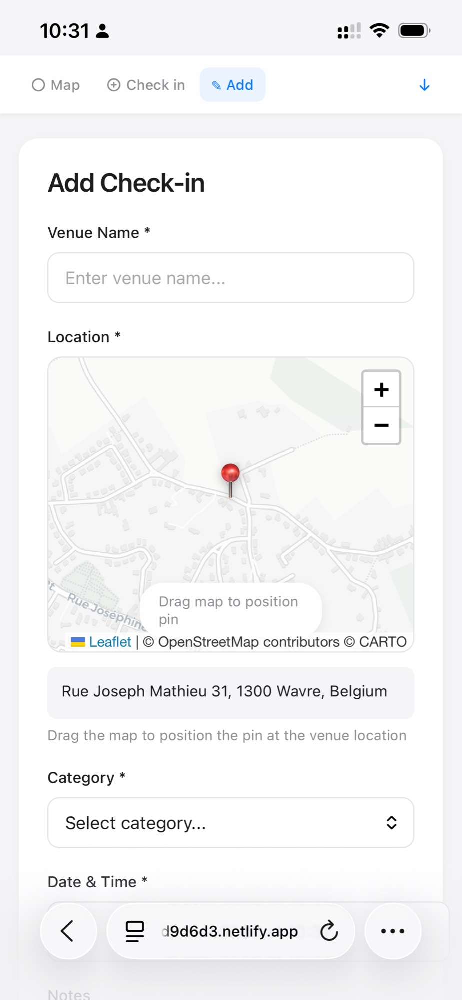

# DroPin

> **The simplest self-hosted travel check-in tracker. Beautiful, privacy-first, and works on any device. No backend needed.**

[](https://opensource.org/licenses/MIT)
[](https://www.netlify.com/)
[](http://makeapullrequest.com)

When Foursquare shut down their Swarm API, millions of check-ins became trapped in a closed ecosystem. DroPin is the open-source alternative: a beautifully designed, privacy-focused check-in tracker you own and control.

Deploy in 5 minutes to Netlify (free), keep your data in a simple CSV file, and enjoy an Apple-like experience on any device. No backend, no database, no tracking—just your travel memories, beautifully visualized.

---

## ✨ Features

- 🗺️ **Interactive Global Map** - Visualize all check-ins with clustering and smooth animations
- ⚡ **Quick Check-in** - Location-based check-in finds nearby venues instantly  
- 📍 **Manual Entry** - Drag-to-position pin placement with auto-geocoding
- 🔍 **Smart Search & Filters** - Find venues by name, filter by country/type/year
- 📤 **CSV Export** - Download all data or just new check-ins
- 🎨 **Minimalist Design** - Clean, Apple-inspired interface
- 📱 **Mobile-First** - Perfect experience on iOS and Android
- 🔒 **Privacy-Focused** - Your data stays yours (CSV files you control)
- 🚀 **Zero Backend** - Just HTML/CSS/JS—deploy anywhere instantly
- 💰 **Free Hosting** - Works on Netlify free tier

---

## 📸 Screenshots

<div align="center">

### World Map with Clustering


*Visualize your travels with color-coded clustering and smooth zoom*

### Regional View with Filters


*Filter by country, venue type, or year to explore your history*

### Check-in Popup with Share


*Tap any pin to see details—share via iOS native sheet or copy*

### Quick Check-in (Location-based)


*Instant check-in: finds nearby venues sorted by distance*

### Manual Add with Pin Placement


*Drag the map to position pin—auto-geocodes address*

</div>

---

## 🚀 Quick Start

### Prerequisites

- Google Maps API key ([Get it here](https://console.cloud.google.com/))
- Geoapify API key ([Free tier available](https://www.geoapify.com/))
- A CSV file with your check-ins (or use our sample data)

### 5-Minute Setup

1. **Clone the repository**
   ```bash
   git clone https://github.com/pingou100/DroPin.git
   cd DroPin
   ```

2. **Configure API keys**
   ```bash
   cp src/config.example.js src/config.js
   # Edit config.js with your API keys
   ```

3. **Add your data**
   ```bash
   # Place your checkins CSV in src/
   cp your_checkins.csv src/checkins_with_addresses.csv
   ```

4. **Deploy to Netlify**
   - Drag `src/` folder to https://app.netlify.com/drop
   - **Done!** Your site is live 🎉

---

## 📖 Documentation

- **[Setup Guide](docs/SETUP.md)** - Detailed installation instructions
- **[API Keys Guide](docs/API-KEYS.md)** - How to get and configure API keys
- **[Netlify Deployment](docs/NETLIFY.md)** - Step-by-step deployment guide
- **[CSV Format](docs/CSV-FORMAT.md)** - Data structure and format

---

## 🎯 Why DroPin?

### The Problem

- **Foursquare/Swarm shut down their API** - millions of check-ins trapped
- **Google owns your location data** - no export, no control
- **Existing solutions are complex** - require databases, servers, technical setup

### The Solution

DroPin is:
- ✅ **Simplest possible architecture** - just HTML + CSV
- ✅ **No backend required** - deploys anywhere (Netlify, Vercel, GitHub Pages)
- ✅ **Your data, your control** - CSV files you own and manage
- ✅ **Beautiful design** - Apple-inspired minimalist UI
- ✅ **Mobile-first** - works perfectly on iOS Safari
- ✅ **Free to host** - Netlify/Vercel free tiers are plenty

---

## 🛠️ Technology Stack

- **Frontend:** Vanilla JavaScript (no framework needed!)
- **Maps:** [Leaflet.js](https://leafletjs.com/) with clustering
- **Geocoding:** [Geoapify](https://www.geoapify.com/) (3,000 free requests/day)
- **Places API:** [Google Places API (New)](https://developers.google.com/maps/documentation/places/web-service/overview)
- **Hosting:** Netlify, Vercel, or any static host
- **Data:** Simple CSV files (no database!)

---

## 💡 Use Cases

- **Former Swarm users** - Export your Foursquare/Swarm data and self-host
- **Privacy-conscious travelers** - Keep location data under your control
- **Digital nomads** - Track your journey across countries
- **Travel bloggers** - Visualize your adventures
- **Location researchers** - Analyze personal mobility patterns

---

## 🌟 Comparison

| Feature | DroPin | Swarm | Google Maps | OwnTracks |
|---------|--------|-------|-------------|-----------|
| Self-hosted | ✅ | ❌ | ❌ | ✅ |
| No backend | ✅ | ❌ | ❌ | ❌ |
| Mobile-optimized | ✅ | ✅ | ✅ | ❌ |
| CSV export | ✅ | ⚠️ | ❌ | ✅ |
| Beautiful UI | ✅ | ✅ | ✅ | ❌ |
| Free hosting | ✅ | ✅ | ✅ | ❌ |
| Setup time | 5 min | N/A | N/A | 2+ hrs |

---

## 🔐 Privacy & Security

- **No external tracking** - Zero analytics, no cookies
- **Your data only** - CSV files you control
- **Local storage** - New check-ins saved in browser until export
- **API keys in browser** - Consider domain restrictions in Google Cloud Console
- **Private repos supported** - Keep your instance completely private

⚠️ **Important:** Never commit `config.js` with real API keys to public repositories. Our `.gitignore` protects you.

---

## 📱 Browser Compatibility

- ✅ **iOS Safari 14+** (requires HTTPS for geolocation)
- ✅ **Chrome 90+**
- ✅ **Firefox 88+**
- ✅ **Edge 90+**
- ✅ **Mobile Safari/Chrome**

---

## 🗺️ Roadmap

- [ ] Dark mode toggle
- [ ] Heatmap visualization
- [ ] Travel statistics dashboard (distance, countries, top cities)
- [ ] PWA support (offline capability)
- [ ] Multi-user support with Firebase/Supabase
- [ ] Import from Foursquare/Swarm exports
- [ ] Custom categories and tags
- [ ] Photo attachments for check-ins
- [ ] Timeline view (chronological list)

---

## 🤝 Contributing

Contributions are welcome! Whether you:
- 🐛 Found a bug
- 💡 Have a feature idea
- 📖 Want to improve documentation
- 🎨 Can enhance the design

**Please feel free to:**
1. Fork the repository
2. Create your feature branch (`git checkout -b feature/AmazingFeature`)
3. Commit your changes (`git commit -m 'Add AmazingFeature'`)
4. Push to the branch (`git push origin feature/AmazingFeature`)
5. Open a Pull Request

---

## 🙏 Acknowledgments

- Inspired by Foursquare/Swarm's amazing check-in experience
- Built with [Leaflet](https://leafletjs.com/) and [Leaflet.markercluster](https://github.com/Leaflet/Leaflet.markercluster)
- Map tiles by [CARTO](https://carto.com/) and [OpenStreetMap](https://www.openstreetmap.org/)
- Geocoding by [Geoapify](https://www.geoapify.com/)
- Places data from [Google Places API](https://developers.google.com/maps/documentation/places)

---

## 📄 License

This project is licensed under the MIT License - see the [LICENSE](LICENSE) file for details.

---

## 💬 Support & Community

- 🐛 **Bug reports:** [GitHub Issues](https://github.com/pingou100/DroPin/issues)
- 💬 **Discussions:** [GitHub Discussions](https://github.com/pingou100/DroPin/discussions)
- ⭐ **Star the repo** if you find it useful!

---

## 🌍 Built for Travelers, by Travelers

DroPin was created because we believe your travel memories should belong to you, not be locked in a corporate database. Whether you've checked in to 10 places or 10,000, your data deserves a beautiful home that you control.

**Start tracking your travels today.** Deploy in 5 minutes, own your data forever.

---

<div align="center">

**[Get Started](docs/SETUP.md)** • **[View Demo](#)** • **[Report Bug](https://github.com/pingou100/DroPin/issues)**

Made with ❤️ for travelers and explorers worldwide

</div>
